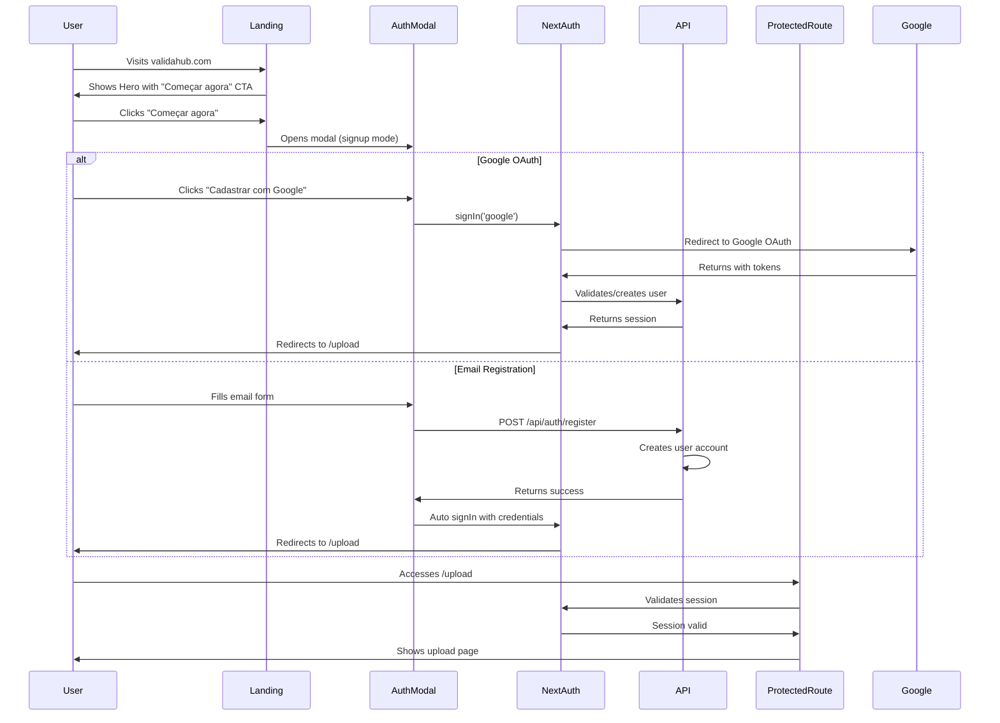

# Authentication Flow Documentation

## Overview
This document describes the authentication flow for the ValidaHub platform, from the landing page through login to accessing protected routes.

## Sequence Diagram



## Authentication States

### 1. Unauthenticated State
- **Location**: Landing page, marketing pages
- **UI Elements**: 
  - Navbar shows "Entrar" and "Cadastrar" buttons
  - Hero CTA "Começar agora" opens signup modal
  - Protected routes redirect to landing

### 2. Authentication Modal
- **Trigger**: Click on auth buttons or CTAs
- **Modes**: 
  - Sign Up (default from CTAs)
  - Sign In (from "Entrar" button)
- **Methods**:
  - Google OAuth (recommended)
  - Email/Password

### 3. Authenticated State
- **Location**: All pages
- **UI Elements**:
  - Navbar shows user avatar and dropdown menu
  - Access to protected routes (/upload, /jobs, etc.)
  - "Começar agora" CTA redirects directly to /upload

## Protected Routes

### Middleware Protection
```typescript
// middleware.ts
const protectedPaths = [
  '/upload',
  '/jobs',
  '/connectors',
  '/mappings',
  '/billing',
  '/results',
  '/settings',
  '/webhooks',
  '/validate-row'
]
```

### Double-Check Pattern
1. **Middleware Level**: Checks session cookie, redirects if missing
2. **Page Level**: Server-side session validation for extra security

## Session Management

### Session Storage
- **Provider**: NextAuth with JWT strategy
- **Duration**: 30 days (configurable)
- **Refresh**: Every 24 hours

### Session Data
```typescript
interface Session {
  user: {
    id: string
    email: string
    name?: string
    image?: string
  }
  expires: string
  accessToken?: string
}
```

## Security Measures

### CSRF Protection
- NextAuth built-in CSRF tokens
- SameSite cookie attributes

### Open Redirect Prevention
- Allowlisted callback URLs
- Sanitized redirect parameters

### Rate Limiting
- Auth endpoints: 5 attempts per 15 minutes
- Password reset: 3 attempts per hour

## Error Handling

### Common Error Scenarios

1. **Invalid Credentials**
   - Message: "Email ou senha inválidos"
   - Action: Show error in modal, clear password field

2. **Account Already Exists**
   - Message: "Este email já está cadastrado"
   - Action: Suggest login instead

3. **OAuth Error**
   - Message: "Erro ao fazer login com Google"
   - Action: Show error, suggest email method

4. **Session Expired**
   - Action: Redirect to landing with callbackUrl parameter

## Implementation Files

### Core Auth Files
- `/app/api/auth/[...nextauth]/route.ts` - NextAuth configuration
- `/lib/auth/session.ts` - Session helpers
- `/middleware.ts` - Route protection

### UI Components
- `/components/ui/AuthModal.tsx` - Authentication modal
- `/components/ui/Navbar.tsx` - Navigation with auth state

### Configuration
- `/config/env.ts` - Environment validation
- `/config/security.ts` - Security headers and policies

## Testing Authentication

### E2E Tests
```bash
npm run test:e2e -- landing.spec.ts
```

### Manual Testing Checklist
- [ ] Can open auth modal from landing
- [ ] Can switch between signin/signup modes
- [ ] Google OAuth flow completes
- [ ] Email registration creates account
- [ ] Protected routes redirect when not authenticated
- [ ] Session persists across page refreshes
- [ ] Logout clears session and redirects

## Environment Variables

Required for authentication:
```env
NEXTAUTH_URL=http://localhost:3000
NEXTAUTH_SECRET=your-secret-key-here
GOOGLE_CLIENT_ID=your-google-client-id
GOOGLE_CLIENT_SECRET=your-google-client-secret
DATABASE_URL=your-database-url
```

## Troubleshooting

### Common Issues

1. **"NEXTAUTH_URL is not set"**
   - Set NEXTAUTH_URL in .env file
   - Must match actual domain in production

2. **Google OAuth not working**
   - Check OAuth consent screen configuration
   - Verify redirect URIs include `/api/auth/callback/google`

3. **Session not persisting**
   - Check NEXTAUTH_SECRET is set
   - Verify cookies are enabled
   - Check SameSite settings for cross-domain issues

## Future Improvements

- [ ] Implement magic link authentication
- [ ] Add two-factor authentication
- [ ] Implement password reset flow
- [ ] Add social login providers (GitHub, LinkedIn)
- [ ] Implement SSO for enterprise customers
- [ ] Add biometric authentication support