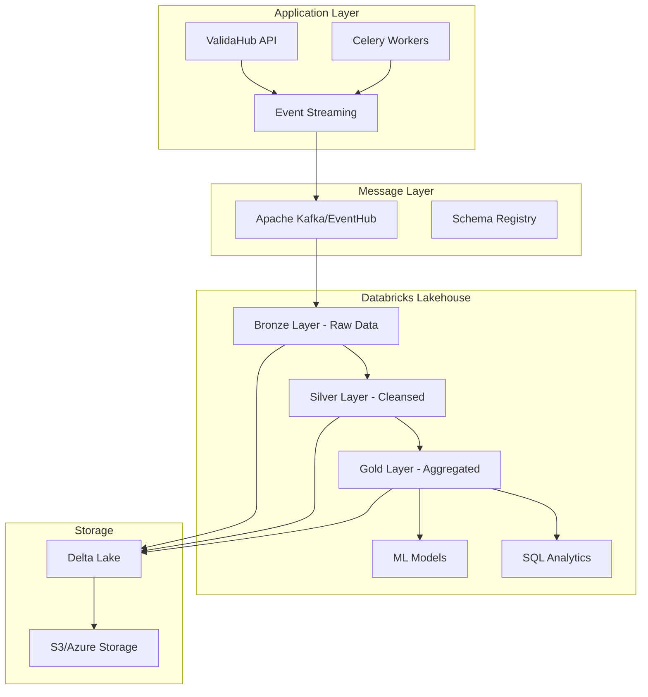

# Databricks Data Lake Integration for ValidaHub

## Overview
Integration of Databricks as a data lake solution for marketplace statistics, telemetry, and advanced analytics.

## Architecture



## Data Architecture

### 1. Bronze Layer (Raw Data)
- **Purpose**: Store raw events exactly as received
- **Format**: JSON/Parquet files
- **Retention**: 90 days
- **Tables**:
  ```sql
  -- validation_events_bronze
  CREATE TABLE validation_events_bronze (
      event_id STRING,
      event_type STRING,
      timestamp TIMESTAMP,
      job_id STRING,
      user_id STRING,
      marketplace STRING,
      category STRING,
      payload STRING,  -- JSON string
      ingestion_time TIMESTAMP,
      source_system STRING
  ) USING DELTA
  PARTITIONED BY (date(timestamp))
  ```

### 2. Silver Layer (Cleansed & Enriched)
- **Purpose**: Cleaned, validated, and enriched data
- **Format**: Delta tables with schema enforcement
- **Retention**: 1 year
- **Tables**:
  ```sql
  -- validation_results_silver
  CREATE TABLE validation_results_silver (
      job_id STRING,
      user_id STRING,
      marketplace STRING,
      category STRING,
      ruleset STRING,
      total_rows BIGINT,
      valid_rows BIGINT,
      invalid_rows BIGINT,
      error_types MAP<STRING, INT>,
      processing_time_ms BIGINT,
      status STRING,
      created_at TIMESTAMP,
      completed_at TIMESTAMP,
      file_size_bytes BIGINT,
      s3_path STRING
  ) USING DELTA
  PARTITIONED BY (marketplace, date(created_at))
  ```

### 3. Gold Layer (Business Aggregates)
- **Purpose**: Pre-aggregated metrics for dashboards
- **Format**: Optimized Delta tables
- **Retention**: 2 years
- **Tables**:
  ```sql
  -- marketplace_daily_metrics_gold
  CREATE TABLE marketplace_daily_metrics_gold (
      date DATE,
      marketplace STRING,
      category STRING,
      total_validations BIGINT,
      successful_validations BIGINT,
      failed_validations BIGINT,
      total_rows_processed BIGINT,
      avg_processing_time_ms DOUBLE,
      unique_users INT,
      error_rate DOUBLE,
      p50_processing_time DOUBLE,
      p95_processing_time DOUBLE,
      p99_processing_time DOUBLE
  ) USING DELTA
  PARTITIONED BY (year(date), month(date))
  ```

## Implementation Components

### 1. Event Streaming Service

```python
# src/infrastructure/streaming/databricks_streamer.py
from typing import Dict, Any, Optional
from datetime import datetime
from pydantic import BaseModel
import json
from kafka import KafkaProducer
from ..core.settings import get_settings

class ValidationEvent(BaseModel):
    """Validation event schema."""
    event_id: str
    event_type: str  # "validation_started", "validation_completed", "validation_failed"
    timestamp: datetime
    job_id: str
    user_id: str
    marketplace: str
    category: Optional[str]
    payload: Dict[str, Any]

class DatabricksStreamer:
    """Stream events to Databricks via Kafka."""
    
    def __init__(self):
        settings = get_settings()
        self.producer = KafkaProducer(
            bootstrap_servers=settings.kafka.bootstrap_servers,
            value_serializer=lambda v: json.dumps(v, default=str).encode('utf-8'),
            compression_type='snappy',
            batch_size=16384,
            linger_ms=100
        )
        self.topic = settings.kafka.validation_events_topic
    
    async def send_event(self, event: ValidationEvent):
        """Send event to Kafka for Databricks ingestion."""
        try:
            future = self.producer.send(
                self.topic,
                value=event.dict(),
                key=event.job_id.encode('utf-8')
            )
            # Wait for confirmation
            record_metadata = future.get(timeout=10)
            return record_metadata
        except Exception as e:
            logger.error(f"Failed to send event to Databricks: {e}")
            raise
    
    def send_batch(self, events: List[ValidationEvent]):
        """Send batch of events."""
        for event in events:
            self.producer.send(
                self.topic,
                value=event.dict(),
                key=event.job_id.encode('utf-8')
            )
        self.producer.flush()
```

### 2. Databricks Connector

```python
# src/infrastructure/databricks/connector.py
from databricks import sql
from typing import Dict, Any, List, Optional
import pandas as pd
from ..core.settings import get_settings

class DatabricksConnector:
    """Connector for Databricks SQL Analytics."""
    
    def __init__(self):
        settings = get_settings()
        self.connection = sql.connect(
            server_hostname=settings.databricks.server_hostname,
            http_path=settings.databricks.http_path,
            access_token=settings.databricks.access_token
        )
    
    def execute_query(self, query: str, params: Optional[Dict] = None) -> pd.DataFrame:
        """Execute SQL query and return results as DataFrame."""
        with self.connection.cursor() as cursor:
            if params:
                cursor.execute(query, params)
            else:
                cursor.execute(query)
            
            # Fetch results
            columns = [desc[0] for desc in cursor.description]
            data = cursor.fetchall()
            return pd.DataFrame(data, columns=columns)
    
    def get_marketplace_metrics(
        self, 
        marketplace: str,
        start_date: str,
        end_date: str
    ) -> Dict[str, Any]:
        """Get marketplace metrics from Gold layer."""
        query = """
        SELECT 
            date,
            total_validations,
            successful_validations,
            failed_validations,
            total_rows_processed,
            avg_processing_time_ms,
            error_rate,
            p50_processing_time,
            p95_processing_time,
            p99_processing_time
        FROM marketplace_daily_metrics_gold
        WHERE marketplace = ?
          AND date BETWEEN ? AND ?
        ORDER BY date
        """
        
        df = self.execute_query(query, [marketplace, start_date, end_date])
        return df.to_dict('records')
    
    def get_real_time_stats(self, marketplace: Optional[str] = None) -> Dict[str, Any]:
        """Get real-time statistics from streaming data."""
        query = """
        WITH recent_data AS (
            SELECT *
            FROM validation_results_silver
            WHERE created_at >= current_timestamp() - INTERVAL 1 HOUR
        )
        SELECT 
            COUNT(*) as total_validations_last_hour,
            AVG(processing_time_ms) as avg_processing_time,
            SUM(total_rows) as total_rows_processed,
            COUNT(DISTINCT user_id) as unique_users,
            marketplace,
            COUNT(*) * 100.0 / SUM(COUNT(*)) OVER() as marketplace_share
        FROM recent_data
        GROUP BY marketplace
        """
        
        df = self.execute_query(query)
        return {
            'real_time_stats': df.to_dict('records'),
            'timestamp': datetime.utcnow().isoformat()
        }
```

### 3. Analytics Repository

```python
# src/infrastructure/repositories/analytics_repository.py
from typing import Dict, Any, List, Optional
from datetime import datetime, timedelta
from ..databricks.connector import DatabricksConnector
from ...core.result import Result, Ok, Err

class AnalyticsRepository:
    """Repository for analytics data from Databricks."""
    
    def __init__(self):
        self.databricks = DatabricksConnector()
    
    def get_marketplace_performance(
        self,
        marketplace: str,
        period_days: int = 30
    ) -> Result[Dict[str, Any], str]:
        """Get marketplace performance metrics."""
        try:
            end_date = datetime.now()
            start_date = end_date - timedelta(days=period_days)
            
            query = """
            SELECT 
                -- Time series metrics
                date,
                total_validations,
                successful_validations,
                error_rate,
                avg_processing_time_ms,
                
                -- Trends
                total_validations - LAG(total_validations) OVER (ORDER BY date) as daily_change,
                AVG(total_validations) OVER (ORDER BY date ROWS BETWEEN 6 PRECEDING AND CURRENT ROW) as ma7_validations,
                
                -- Categories breakdown
                category,
                SUM(total_rows_processed) as rows_by_category
                
            FROM marketplace_daily_metrics_gold
            WHERE marketplace = ?
              AND date >= ?
              AND date <= ?
            GROUP BY date, category
            ORDER BY date DESC
            """
            
            df = self.databricks.execute_query(
                query, 
                [marketplace, start_date.date(), end_date.date()]
            )
            
            return Ok({
                'marketplace': marketplace,
                'period_days': period_days,
                'metrics': df.to_dict('records'),
                'summary': self._calculate_summary(df)
            })
            
        except Exception as e:
            return Err(f"Failed to get marketplace performance: {str(e)}")
    
    def get_ml_predictions(
        self,
        marketplace: str,
        category: str
    ) -> Result[Dict[str, Any], str]:
        """Get ML predictions for validation patterns."""
        try:
            query = """
            SELECT 
                prediction_date,
                predicted_volume,
                predicted_error_rate,
                confidence_level,
                anomaly_score
            FROM ml_predictions
            WHERE marketplace = ?
              AND category = ?
              AND prediction_date >= current_date()
            ORDER BY prediction_date
            LIMIT 30
            """
            
            df = self.databricks.execute_query(query, [marketplace, category])
            
            return Ok({
                'predictions': df.to_dict('records'),
                'model_version': 'v1.2.0',
                'last_trained': '2024-01-15'
            })
            
        except Exception as e:
            return Err(f"Failed to get ML predictions: {str(e)}")
```

## Databricks Jobs & Pipelines

### 1. Bronze to Silver ETL

```python
# databricks_notebooks/bronze_to_silver.py
from pyspark.sql import SparkSession
from pyspark.sql.functions import *
from delta.tables import DeltaTable

# Read from Bronze
bronze_df = spark.readStream \
    .format("delta") \
    .option("ignoreChanges", "true") \
    .table("validation_events_bronze")

# Parse JSON payload
parsed_df = bronze_df \
    .withColumn("parsed_payload", from_json(col("payload"), schema)) \
    .select("*", "parsed_payload.*") \
    .drop("payload", "parsed_payload")

# Data quality checks
cleaned_df = parsed_df \
    .filter(col("job_id").isNotNull()) \
    .filter(col("marketplace").isNotNull()) \
    .withColumn("processing_time_ms", 
                when(col("processing_time_ms") < 0, None)
                .otherwise(col("processing_time_ms")))

# Write to Silver
query = cleaned_df.writeStream \
    .format("delta") \
    .outputMode("append") \
    .option("checkpointLocation", "/checkpoint/bronze_to_silver") \
    .trigger(processingTime="5 minutes") \
    .table("validation_results_silver")
```

### 2. Silver to Gold Aggregation

```python
# databricks_notebooks/silver_to_gold.py
from pyspark.sql import SparkSession
from pyspark.sql.functions import *
from pyspark.sql.window import Window

# Read from Silver
silver_df = spark.read \
    .format("delta") \
    .table("validation_results_silver") \
    .filter(col("created_at") >= date_sub(current_date(), 1))

# Daily aggregations
daily_metrics = silver_df \
    .groupBy(
        date_format("created_at", "yyyy-MM-dd").alias("date"),
        "marketplace",
        "category"
    ) \
    .agg(
        count("*").alias("total_validations"),
        sum(when(col("status") == "success", 1).otherwise(0)).alias("successful_validations"),
        sum(when(col("status") == "failed", 1).otherwise(0)).alias("failed_validations"),
        sum("total_rows").alias("total_rows_processed"),
        avg("processing_time_ms").alias("avg_processing_time_ms"),
        expr("percentile_approx(processing_time_ms, 0.5)").alias("p50_processing_time"),
        expr("percentile_approx(processing_time_ms, 0.95)").alias("p95_processing_time"),
        expr("percentile_approx(processing_time_ms, 0.99)").alias("p99_processing_time"),
        countDistinct("user_id").alias("unique_users")
    ) \
    .withColumn("error_rate", 
                col("failed_validations") / col("total_validations"))

# Merge into Gold table
gold_table = DeltaTable.forName(spark, "marketplace_daily_metrics_gold")
gold_table.alias("gold") \
    .merge(
        daily_metrics.alias("updates"),
        "gold.date = updates.date AND gold.marketplace = updates.marketplace AND gold.category = updates.category"
    ) \
    .whenMatchedUpdateAll() \
    .whenNotMatchedInsertAll() \
    .execute()
```

## Machine Learning Pipeline

### Anomaly Detection Model

```python
# databricks_notebooks/ml_anomaly_detection.py
from pyspark.ml.feature import VectorAssembler
from pyspark.ml.clustering import KMeans
from pyspark.ml import Pipeline

# Feature engineering
features_df = spark.sql("""
    SELECT 
        marketplace,
        category,
        hour(created_at) as hour_of_day,
        dayofweek(created_at) as day_of_week,
        total_rows,
        processing_time_ms,
        invalid_rows * 100.0 / total_rows as error_rate,
        LAG(total_rows, 1) OVER (PARTITION BY marketplace ORDER BY created_at) as prev_volume
    FROM validation_results_silver
    WHERE created_at >= current_date() - 30
""")

# Vector assembler
assembler = VectorAssembler(
    inputCols=["hour_of_day", "day_of_week", "total_rows", "processing_time_ms", "error_rate"],
    outputCol="features"
)

# K-Means clustering for anomaly detection
kmeans = KMeans(k=5, seed=1, featuresCol="features", predictionCol="cluster")

# Pipeline
pipeline = Pipeline(stages=[assembler, kmeans])
model = pipeline.fit(features_df)

# Score new data
predictions = model.transform(features_df)

# Calculate anomaly scores
anomaly_scores = predictions \
    .groupBy("cluster") \
    .agg(
        count("*").alias("cluster_size"),
        avg("error_rate").alias("avg_error_rate")
    ) \
    .withColumn("anomaly_score", 
                when(col("cluster_size") < 10, 1.0)
                .when(col("avg_error_rate") > 0.1, 0.8)
                .otherwise(0.2))

# Save model
model.write().overwrite().save("/models/anomaly_detection/v1")
```

## Configuration

```python
# src/core/settings.py additions
class DatabricksSettings(BaseSettings):
    """Databricks configuration."""
    server_hostname: str = Field(
        default="adb-xxxxx.azuredatabricks.net",
        env="DATABRICKS_SERVER_HOSTNAME"
    )
    http_path: str = Field(
        default="/sql/1.0/warehouses/xxxxx",
        env="DATABRICKS_HTTP_PATH"
    )
    access_token: str = Field(
        default="dapi-xxxxx",
        env="DATABRICKS_ACCESS_TOKEN"
    )
    catalog: str = Field(default="validahub", env="DATABRICKS_CATALOG")
    schema: str = Field(default="analytics", env="DATABRICKS_SCHEMA")
    
class KafkaSettings(BaseSettings):
    """Kafka configuration for streaming."""
    bootstrap_servers: List[str] = Field(
        default=["localhost:9092"],
        env="KAFKA_BOOTSTRAP_SERVERS"
    )
    validation_events_topic: str = Field(
        default="validation-events",
        env="KAFKA_VALIDATION_TOPIC"
    )
    consumer_group: str = Field(
        default="databricks-consumer",
        env="KAFKA_CONSUMER_GROUP"
    )
```

## Benefits

### 1. Scalability
- Handle billions of validation events
- Auto-scaling compute clusters
- Distributed processing with Spark

### 2. Real-time Analytics
- Streaming ingestion with <1 minute latency
- Live dashboards and alerts
- Real-time anomaly detection

### 3. Advanced Analytics
- Machine learning models for predictions
- Pattern recognition and anomaly detection
- Trend analysis and forecasting

### 4. Cost Optimization
- Tiered storage (hot/warm/cold)
- Automatic data lifecycle management
- Pay-per-query pricing for analytics

### 5. Data Governance
- Unity Catalog for data governance
- Fine-grained access control
- Data lineage and audit trails

## Monitoring & Alerting

### Key Metrics to Monitor
1. **Data Quality**
   - Schema violations
   - Missing required fields
   - Data freshness

2. **Performance**
   - Ingestion latency
   - Query performance
   - Pipeline SLA adherence

3. **Business Metrics**
   - Validation volumes by marketplace
   - Error rate trends
   - User engagement patterns

### Alert Rules
```sql
-- Alert on high error rates
CREATE ALERT high_error_rate
AS SELECT marketplace, error_rate
FROM marketplace_daily_metrics_gold
WHERE date = current_date()
  AND error_rate > 0.1
  
-- Alert on processing delays
CREATE ALERT processing_delays
AS SELECT marketplace, avg_processing_time_ms
FROM marketplace_daily_metrics_gold
WHERE date = current_date()
  AND avg_processing_time_ms > 5000
```

## Migration Plan

### Phase 1: Setup Infrastructure (Week 1-2)
- [ ] Provision Databricks workspace
- [ ] Setup Kafka/Event Hub
- [ ] Configure Delta Lake storage
- [ ] Create Bronze/Silver/Gold schemas

### Phase 2: Implement Streaming (Week 3-4)
- [ ] Deploy event streaming service
- [ ] Implement Kafka producers
- [ ] Setup Databricks streaming jobs
- [ ] Test end-to-end pipeline

### Phase 3: Build Analytics (Week 5-6)
- [ ] Create aggregation jobs
- [ ] Build ML models
- [ ] Develop dashboards
- [ ] Setup monitoring

### Phase 4: Production Rollout (Week 7-8)
- [ ] Gradual traffic migration
- [ ] Performance tuning
- [ ] Documentation
- [ ] Team training

## Cost Estimation

### Monthly Costs (Estimated)
- **Databricks Compute**: $3,000-5,000
  - Jobs cluster: ~100 DBU/day
  - SQL warehouse: ~50 DBU/day
  
- **Storage**: $500-1,000
  - Delta Lake: ~5TB/month
  - S3/Azure Storage
  
- **Streaming**: $1,000-2,000
  - Kafka/Event Hub
  - Network transfer
  
- **Total**: $4,500-8,000/month

### ROI Justification
- Reduced manual analysis time: 80% reduction
- Faster issue detection: From hours to minutes
- Better decision making with ML insights
- Scalability for 10x growth without additional ops

## Conclusion

Integrating Databricks as a data lake for ValidaHub's marketplace statistics and telemetry provides:
- Unified analytics platform
- Real-time insights
- Scalable architecture
- Advanced ML capabilities
- Cost-effective solution for growing data needs

This architecture positions ValidaHub for data-driven growth and operational excellence.